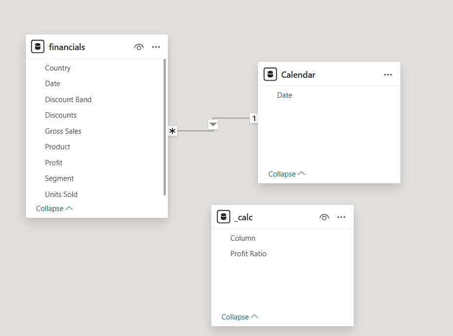
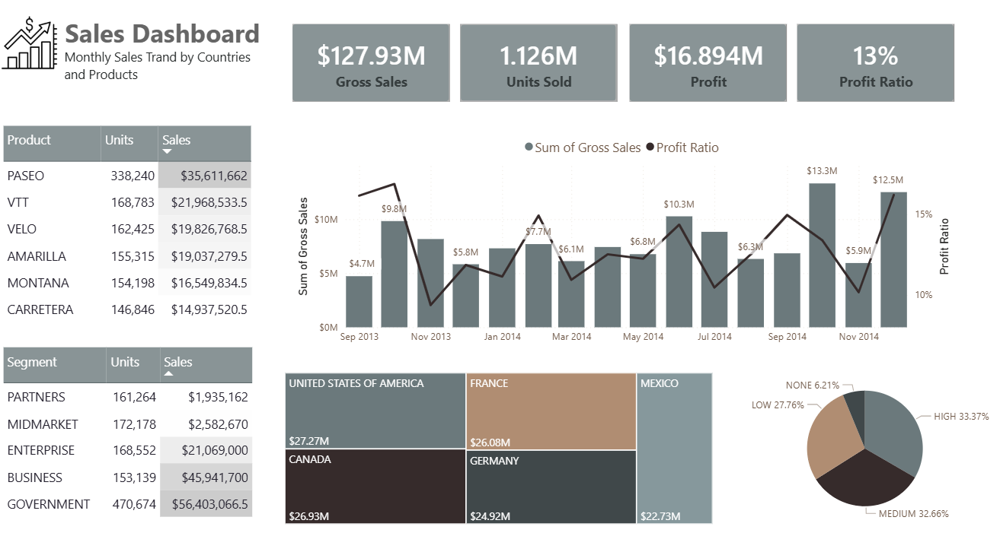

# Financial Sales Analysis Dashboard

## Project Overview

This project analyzes financial sales sample data and presents key revenue, volume, and profitability metrics in an interactive Power BI dashboard.
The report is based on the built-in Power BI sample `financials` table, with additional Power BI tables created for date analysis and calculated measures.

The objective was to:

- Monitor gross sales, units sold, profit, and profit ratio

- Analyze monthly sales trends by country and product

- Compare sales performance across products and customer segments

- Evaluate geographic contribution to gross sales

- Analyze sales distribution by discount band

## Tools & Technologies

- Power BI Desktop

- Power Query

- DAX

## Source Data & Data Model

The analysis is based on one built-in Power BI sample table:

- `financials` - sales transactions with country, product, segment, discount band, date, gross sales, units sold, and profit fields

Additional helper tables were created in Power BI:

- `Calendar` - date table used to structure dates and support monthly trend analysis

- `_calc` - dedicated measure table used to store new DAX measures such as profit ratio

### Data Model Schema



## Data Preparation

The data cleaning and modeling process was performed directly in Power BI using Power Query and DAX. The preparation included:

- Loading the `financials` source table into Power BI

- Using Power BI sample data as the source dataset

- Standardizing fields used for sales, product, country, segment, and discount analysis

- Creating a calendar table to structure dates for date-based reporting

- Creating a `_calc` table to store new DAX measures for profit ratio and KPI calculations

- Building report visuals for trend, category, geographic, and discount analysis

## Dashboard



The dashboard includes:

- **KPI Overview** - gross sales ($127.93M), units sold (1.126M), profit ($16.894M), and profit ratio (13%)

- **Monthly Sales Trend** - gross sales and profit ratio by date

- **Product Analysis** - product-level comparison of sales and units sold

- **Segment Analysis** - segment-level comparison of sales and units sold

- **Country Analysis** - gross sales distribution by country

- **Discount Analysis** - gross sales distribution by discount band

## Key Insights

- Total gross sales reached **$127.93M**, with **1.126M** units sold and **$16.894M** in profit

- Overall profit ratio is **13%**

- Top product by sales is **PASEO** (**$35.61M**, 338,240 units), followed by **VTT** (**$21.97M**) and **VELO** (**$19.83M**)

- Top segment by sales is **Government** (**$56.40M**, 470,674 units), followed by **Business** (**$45.94M**)

- Country-level sales are led by the **United States of America** (**$27.27M**), **Canada** (**$26.93M**), and **France** (**$26.08M**)

- The highest monthly gross sales point shown in the trend is **$13.3M**

- Sales are distributed mainly across **High** (**33.37%**), **Medium** (**32.66%**), and **Low** (**27.76%**) discount bands

## How to Run

1. Clone this repository

2. Open the [`.pbix` file](dashboard/dash.pbix) in Power BI Desktop

3. Review the data model and Power Query transformations

4. Explore the dashboard visuals and interact with report elements

## Project Structure

```text
financial-sales-analysis-dashboard/
├── docs/
│   └── data_model.png
├── dashboard/
│   └── dash.pbix
├── screenshots/
│   └── dashboard_preview.png
└── README.md
```
